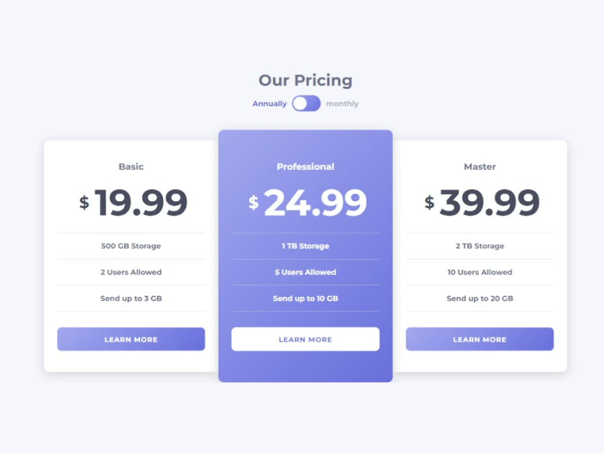

# Pricing component with toggle - Frontend Mentor Challenge

## Welcome! 

## The challenge

The challenge is to build out this pricing component and get it looking as close to the design as possible.

Your users should be able to:

- View the optimal layout for the component depending on their device's screen size
- Control the toggle with both their mouse/trackpad and their keyboard

## Wireframe

You can check the wireframe in `/design` folder. You will find both a mobile and a desktop version of the design. 
